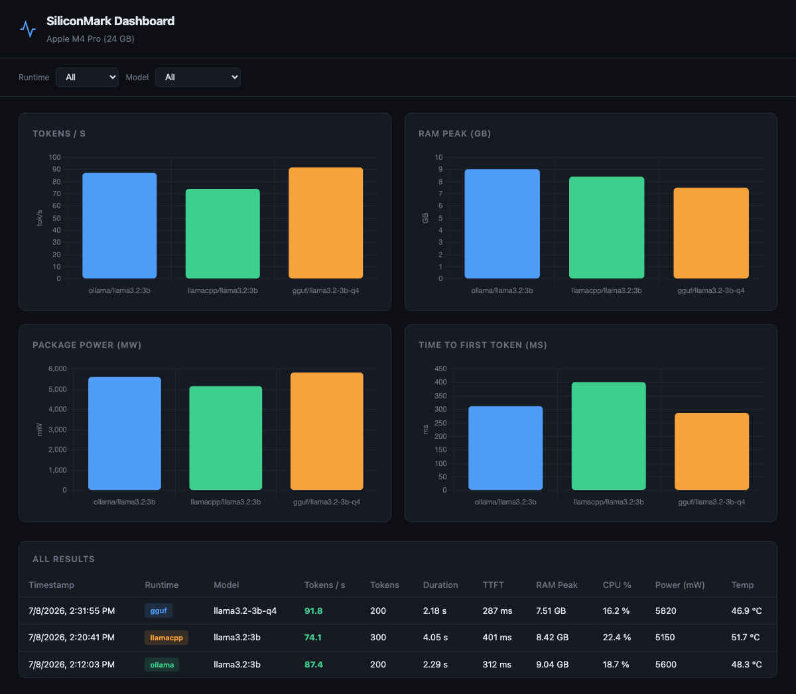

<div align="center">
  

  <h1>SiliconMark</h1>
</div>

[🇬🇧 English Version](README.md)

**Sagt dir, ob dieses Modell auf deinem Mac wirklich läuft, bevor du eine Stunde mit Herunterladen verbringst.**

Auf der Modellkarte steht 7B Parameter. Daraus geht nicht hervor, ob es neben
allem anderen, was du offen hast, in den Unified Memory passt, wie schnell es
antwortet, oder ob dein MacBook dabei heiss läuft und den Akku leersaugt.

SiliconMark misst das auf deiner Maschine: Token pro Sekunde, RAM,
Energiebedarf, Neural-Engine-Auslastung und Temperatur.

```
siliconmark list-runtimes    was installiert und nutzbar ist
siliconmark run              ein Modell benchmarken, Zahlen bekommen
siliconmark device           was dieser Mac ist
siliconmark dashboard        die Ergebnisse nebeneinander
```

**Nichts für dich, wenn** du Macs vergleichen willst, die dir nicht gehören.
Dafür gibt es veröffentlichte Benchmark-Tabellen. Das hier misst die Maschine,
an der du sitzt, mit deinen Modellen und deinem Speicherdruck.

[](https://github.com/9t29zhmwdh-coder/SiliconMark/actions) [](https://github.com/9t29zhmwdh-coder/SiliconMark/security/code-scanning) [](https://securityscorecards.dev/viewer/?uri=github.com/9t29zhmwdh-coder/SiliconMark) [](https://www.bestpractices.dev/projects/13685)
     



---

> 🌱 Neu hier? → [Schritt-für-Schritt-Anleitung für Einsteiger](GETTING_STARTED.md)

---

## Funktionen

| | |
|---|---|
| **Runtimes** | Ollama · llama.cpp Server · MLC-LLM · Direktes GGUF (llama-cpp-python) |
| **Metriken** | Token/s · Zeit bis zum ersten Token · RAM (Mittelwert & Peak) · CPU-Auslastung |
| **Apple-spezifisch** | Package-/CPU-/GPU-/ANE-Leistung (mW) · CPU-Die-Temperatur |
| **Export** | Strukturiertes JSON: eine Datei pro Lauf |
| **Dashboard** | Web-UI mit Chart.js-Diagrammen: `siliconmark dashboard` |
| **Erweiterbar** | Neue Runtime in ~40 Zeilen durch Subklassen von `BaseRuntime` |

> **Leistungsmetriken** benötigen `sudo powermetrics` ohne Passwort-Prompt.  
> Siehe [Energiemetriken aktivieren](#energiemetriken-aktivieren).

---

## Voraussetzungen

- macOS 13+ auf Apple Silicon (M1 / M2 / M3 / M4)
- Python 3.11+

---

## Installation

```bash
# Neueste Version direkt von GitHub installieren
pip install git+https://github.com/9t29zhmwdh-coder/SiliconMark.git

# Optional: GGUF-Unterstützung (llama-cpp-python mit Metal)
pip install "siliconmark[gguf] @ git+https://github.com/9t29zhmwdh-coder/SiliconMark.git"
```

Versionierte Wheel- und sdist-Dateien liegen auch an jedem [GitHub Release](https://github.com/9t29zhmwdh-coder/SiliconMark/releases), falls du eine exakte Version fixieren oder offline installieren willst.

Oder für die Entwicklung klonen und im editierbaren Modus installieren:

```bash
git clone https://github.com/9t29zhmwdh-coder/SiliconMark.git
cd SiliconMark
pip install -e .
```

---

## Schnellstart

```bash
# Ollama benchmarken
siliconmark run --runtime ollama --model llama3.2:3b

# llama.cpp-Server benchmarken
siliconmark run --runtime llamacpp --model llama3.2 --tokens 300

# Eine GGUF-Datei direkt benchmarken
siliconmark run --runtime gguf --model llama3.2 --model-path ~/models/llama3.2-3b.Q4_K_M.gguf

# Das visuelle Dashboard öffnen
siliconmark dashboard --results ./results
```

---

## CLI-Referenz

```
Usage: siliconmark [OPTIONS] COMMAND [ARGS]...

Commands:
  run             Führt einen Benchmark aus (Runtime + Modell)
  dashboard       Startet das Web-Dashboard
  list-runtimes   Zeigt alle verfügbaren Runtimes
  device          Gibt den erkannten Apple-Silicon-Chip aus
```

### `siliconmark run`

| Option | Standard | Beschreibung |
|--------|----------|--------------|
| `--runtime` / `-r` | *(erforderlich)* | `ollama` · `llamacpp` · `mlc` · `gguf` |
| `--model` / `-m` | *(erforderlich)* | Modellname (z. B. `llama3.2:3b`) |
| `--model-path` / `-p` | - | Pfad zur `.gguf`-Datei (nur gguf-Runtime) |
| `--tokens` / `-t` | `200` | Anzahl zu generierender Tokens |
| `--prompt` | *(Standard)* | Eigener Benchmark-Prompt |
| `--output` / `-o` | `./results` | Verzeichnis für JSON-Ergebnisse |
| `--no-warmup` | `false` | Warmup-Inferenzaufruf überspringen |

### `siliconmark dashboard`

| Option | Standard | Beschreibung |
|--------|----------|--------------|
| `--results` / `-r` | `./results` | Zu ladendes Ergebnisverzeichnis |
| `--host` | `127.0.0.1` | Bind-Adresse |
| `--port` / `-p` | `8080` | Port |

---

## JSON-Ergebnisschema

Jeder Lauf speichert eine Datei in `./results/`:

```json
{
  "id": "a3f2c1b0",
  "timestamp": "2026-06-10T18:32:11",
  "device": "Apple M4 Pro (24 GB)",
  "config": {
    "runtime": "ollama",
    "model": { "name": "llama3.2:3b" },
    "max_tokens": 200,
    "warmup": true
  },
  "performance": {
    "tokens_per_second": 87.4,
    "time_to_first_token_ms": 312,
    "total_tokens": 200,
    "total_duration_s": 2.29,
    "prompt_tokens": 42
  },
  "system": {
    "ram_used_gb_mean": 8.21,
    "ram_used_gb_peak": 9.04,
    "ram_percent_mean": 34.2,
    "cpu_percent_mean": 18.7,
    "apple": {
      "cpu_power_mw": 3240,
      "gpu_power_mw": 1820,
      "ane_power_mw": 540,
      "package_power_mw": 5600,
      "cpu_die_temp_celsius": 48.3
    }
  }
}
```

---

## Runtime-Einrichtung

### Ollama

```bash
brew install ollama
ollama serve          # läuft auf localhost:11434
ollama pull llama3.2:3b
```

### llama.cpp-Server

```bash
brew install llama.cpp
llama-server -m ~/models/llama3.2-3b.Q4_K_M.gguf --port 8080
```

### GGUF (direkt)

```bash
pip install "siliconmark[gguf]"
siliconmark run --runtime gguf --model my-model \
  --model-path ~/models/llama3.2-3b.Q4_K_M.gguf
```

### MLC-LLM

```bash
pip install mlc-llm
# Modell-Downloads siehe https://llm.mlc.ai
```

---

## Energiemetriken aktivieren

Leistungs- und Temperaturmetriken benötigen passwortloses `sudo` für `powermetrics`.

```bash
sudo visudo
# Diese Zeile hinzufügen (YOUR_USERNAME ersetzen):
YOUR_USERNAME ALL=(ALL) NOPASSWD: /usr/bin/powermetrics
```

Falls nicht konfiguriert, läuft SiliconMark normal weiter, Apple-spezifische Felder sind dann `null`.

---

## Eigene Runtime hinzufügen

1. `siliconmark/runtimes/myruntime.py` erstellen
2. Von `BaseRuntime` ableiten und `infer()` implementieren
3. In `siliconmark/core/registry.py` registrieren

```python
# siliconmark/runtimes/myruntime.py
from siliconmark.runtimes.base import BaseRuntime, InferenceResult


class MyRuntime(BaseRuntime):
    name = "myruntime"

    def infer(self, prompt: str, max_tokens: int) -> InferenceResult:
        # ... eigene Runtime aufrufen ...
        return InferenceResult(
            tokens_generated=n,
            total_duration_s=elapsed,
            time_to_first_token_ms=ttft,
            prompt_tokens=None,
            raw_response=text,
        )
```

```python
# siliconmark/core/registry.py  eine Zeile ergänzen:
"myruntime": "siliconmark.runtimes.myruntime:MyRuntime",
```

---

## Projektstruktur

```
siliconmark/
├── cli.py                   # Typer-CLI-Einstiegspunkt
├── core/
│   ├── models.py            # Pydantic-Ergebnismodelle
│   ├── runner.py            # Benchmark-Orchestrierung + Geräteerkennung
│   └── registry.py         # Runtime-Registry
├── runtimes/
│   ├── base.py              # Abstrakte BaseRuntime
│   ├── ollama.py            # Ollama-REST-Adapter
│   ├── llamacpp.py          # llama.cpp-Server-Adapter
│   ├── mlc.py               # MLC-LLM-Adapter
│   └── gguf.py              # llama-cpp-python-Adapter
├── metrics/
│   ├── collector.py         # Hintergrund-RAM/CPU-Sampler (Threading)
│   └── apple.py             # powermetrics-Wrapper
├── exporters/
│   └── json_exporter.py     # JSON speichern/laden
└── dashboard/
    ├── app.py               # FastAPI-Server
    └── static/index.html    # Chart.js-Dashboard-UI
```

---

## Entwicklung

```bash
pip install -e ".[dev]"
pytest tests/
```

---

**Autor:** [Rafael Yilmaz](https://github.com/9t29zhmwdh-coder) · **Status:** Active ·  · **Lizenz:** MIT
